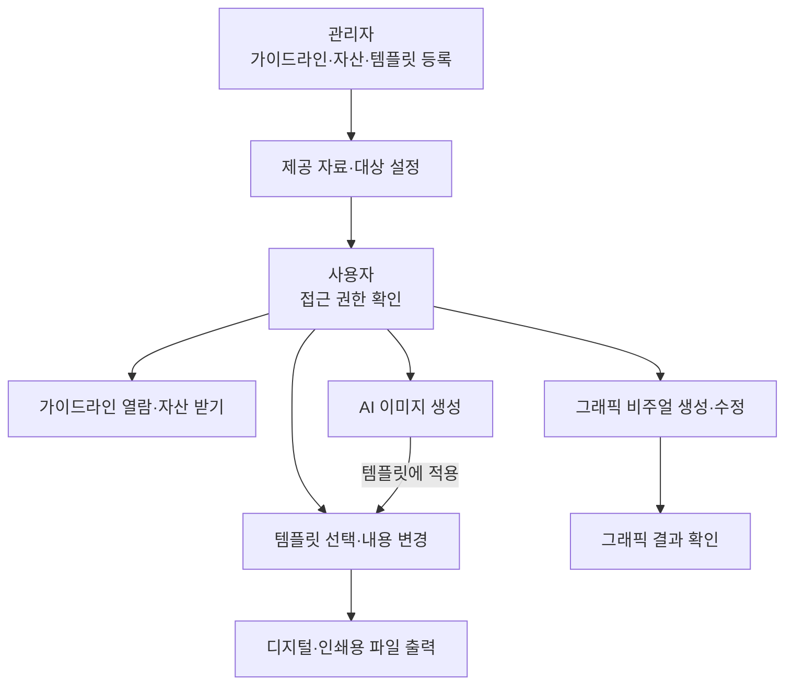
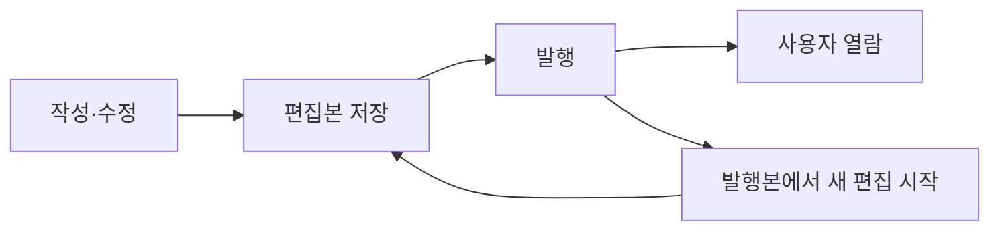

# LBS 운영설계서

> 2026-09-18 · v0.9 · 개발자 검토용
> [개발 협의 부록](01-operation-design-appendix.md) · [작업 일정(WBS)](https://docs.google.com/spreadsheets/d/1EgJ3HHAPE551D8fE7CVxjeFJzL0_mTvgTYd1JU9XeN0/edit)

## 1. 서비스 개요

Living Brand System(이하 LBS)은 브랜드 가이드라인을 관리하고, 그 기준으로 결과물을 제작하는 서비스입니다.
관리자는 가이드라인·자산·템플릿을 등록합니다. 사용자는 허용된 자료를 열람하고 포스터·배너, AI 이미지, 그래픽 비주얼을 만듭니다.

이 문서는 서비스의 동작과 운영 기준을 정의합니다. 개발 범위와 남은 결정 사항을 팀원·상급자와 협의할 때 사용합니다.

| 구분 | 역할 |
|---|---|
| 관리자(Brand Owner) | 어드민에서 가이드라인·템플릿·제공 대상을 관리합니다. |
| 사용자(Creator) | 유저 페이지에서 가이드라인을 읽고 결과물을 제작·내려받습니다. |

1차 목표일은 **2026년 10월 16일**입니다. 실제 동작하는 서비스를 내부에 배포하고, 대표님 확인 후 다음 방향을 판단합니다.

## 2. 전체 운영 흐름

관리자가 준비한 자료는 권한에 따라 사용자에게 제공됩니다.
사용자는 가이드라인을 열람하거나 필요한 제작 기능을 선택합니다.

AI 이미지와 그래픽 비주얼은 각각 생성 결과를 확인합니다. 그래픽의 파일 제공 방식과 템플릿 연결 범위는 협의 사항입니다.

## 3. 어드민 페이지

### 가이드라인 관리

관리자는 가이드라인 데이터와 자산을 업로드합니다.
중앙 편집 화면에서 텍스트·이미지 블록을 조립하고 내용을 수정합니다.

- 블록 추가·순서 변경·내용 수정
- 작성 내용 저장·다시 열기
- 발행 버전·일시 확인
- 수정 내용 발행

### 템플릿 관리

관리자는 준비된 템플릿을 등록하고 갤러리에 제공할 내용을 정합니다.
사용자가 변경할 수 있는 텍스트·이미지 항목도 설정합니다.

템플릿은 준비 완료 상태입니다. 개발자는 파일 형식과 제품 등록 가능 여부를 확인합니다.

### 데이터와 접근 관리

관리자는 제공할 가이드라인·자산과 허용 대상을 지정합니다.
계열사 등 대상에 따라 일부 자료만 제공할 수 있어야 합니다.

관리자와 사용자의 권한을 구분합니다. 구체적인 접근 설정 방식과 일부 발행 단위는 회의에서 정합니다.

## 4. 유저 페이지

### 가이드라인 열람

사용자는 발행된 가이드라인을 읽고 목차로 필요한 항목을 찾습니다.
현재 버전·수정일을 확인하고, 연결된 브랜드 자산을 내려받습니다.

### 템플릿 활용

사용자는 갤러리에서 포스터 또는 배너 템플릿을 선택합니다.
허용된 텍스트·이미지를 변경하고 결과를 확인합니다.

**템플릿**은 디자인 견본, **판형**은 결과물의 크기와 규격입니다. 최초 지원 종류·수량·판형은 협의합니다.

### AI 이미지 생성

사용자는 브랜드 콘셉트에 맞는 이미지를 생성합니다.
생성 결과를 확인하고 선택한 이미지를 템플릿에 적용합니다.

### 그래픽 비주얼 생성·수정

사용자는 브랜드 콘셉트에 맞는 그래픽을 생성하고 허용된 항목을 수정합니다.
그래픽 종류와 수정 가능한 항목은 UX 목업·기술 검토에서 정합니다.

### 디지털·인쇄용 출력

사용자는 완성된 적용물을 디지털용 또는 인쇄용 파일로 내려받습니다.
두 용도 모두 1차에 포함합니다.

| 출력 용도 | 확인할 결과 |
|---|---|
| 디지털용 | 합의한 픽셀 크기·파일 형식과 텍스트·이미지 반영 결과 |
| 인쇄용 | 합의한 실물 크기·품질과 글꼴·이미지·레이아웃 반영 결과 |

출력은 파일 제공까지를 뜻합니다. 세부 규격은 개발 전에 합의하고, 완료 시 실제 파일과 대조합니다.

## 5. 공통 운영 기준

### 접근 권한

화면·데이터·원본 자산·생성 결과에 같은 접근 범위를 적용합니다.
생성·출력 요청에도 권한을 확인합니다. 비허용자는 파일 주소를 알아도 자료를 받을 수 없어야 합니다.

### 저장·버전·발행

저장한 편집본과 사용자에게 제공하는 발행본을 구분하는 안을 제안합니다.

관리자는 현재 편집본과 발행 버전을 확인합니다. 사용자는 발행된 내용과 버전·수정일을 확인합니다.
자동 저장 여부, 발행 반영 시점, 이력 표시 범위는 협의합니다.

### 처리 상태와 실패

- 저장·생성·출력 중에는 진행 상태를 표시합니다.
- 실패한 작업을 완료로 표시하지 않습니다.
- 생성·파일 제공에 실패하면 재시도할 수 있게 합니다.
- 발행 실패 시 기존 발행본을 유지하는 안을 제안합니다.

### 개발과 중간 공유

프론트엔드 1명, 백엔드 1명, UX 목업·AI 기술 테스트 1명이 참여합니다.
송준님이 UX 목업과 AI 테스트를 맡습니다. 1차 디자인 산출물은 UX 목업까지입니다.

**WBS의 각 세부 업무 종료 시점을 중간 공유 시점으로 사용합니다.**
담당자는 결과와 남은 문제를 공유하고, 다음 작업 담당자는 착수에 필요한 내용을 확인합니다.

공유 기록: `업무 · 결과 링크·버전 · 확인자 · 수정 사항 · 다음 작업 영향`

## 6. 단계별 구축 범위

### 1차: 핵심 기능 구현·내부 배포

가이드라인을 우선 구현하고 템플릿 기반 제작을 연결합니다.
1차 완료는 다음 네 시나리오를 배포 환경에서 확인한 상태입니다.

| 시나리오 | 완료 기준 |
|---|---|
| 관리자 업로드·사용자 열람 | 블록 편집·저장·다시 열기·일부 발행이 동작합니다. 허용된 자료만 열람·다운로드하며, 재발행한 내용과 버전이 반영됩니다. |
| 포스터 또는 배너 제작 | 등록한 템플릿을 선택·변경하고 디지털용과 인쇄용 파일을 각각 받습니다. |
| AI 이미지 생성 | 실제 이미지를 생성하고 템플릿에 적용합니다. 실패·재시도도 확인합니다. |
| 그래픽 비주얼 생성 | 그래픽을 생성하고 합의한 항목을 수정해 결과를 확인합니다. |

실제 동작에 필요한 최소 백엔드를 연결합니다. 신규 구현과 기존 기반 활용의 범위는 회의에서 정합니다.

10/16은 목표일이며 개발 공수는 검토 전입니다. 일정 조정 시 템플릿·블록 종류와 편의 기능부터 줄입니다. 필수 기능 변경은 별도로 합의합니다.

### 2차: 기능 확장·브랜드별 제공

| 영역 | 확장 내용 |
|---|---|
| 어드민 | 템플릿·블록 종류, 브랜드별 구성, 버전·발행 관리 확대 |
| 그래픽·AI 관리 | 브랜드별 그래픽 설정, 프롬프트·생성 기준, 템플릿 연결 관리 |
| 유저 | 포스터·배너 외 결과물, AI 생성·편집 기능, 출력 규격·형식 확대 |
| 백엔드 | 저장·권한·버전·발행 관리 확장, 생성·출력 처리 고도화 |
| 설치·인계 | 브랜드별 독립 설치, 데이터·자산 분리, 맞춤 설정, 사용·운영·지원 인계 |

공통 원본을 복제해 브랜드별 설치본을 준비합니다. 원본과 설치본은 버전을 별도로 관리하며, 업데이트는 대상과 영향을 확인한 뒤 적용합니다.

2차는 추가 기능의 실제 동작과 별도 환경의 설치·인계 결과를 확인합니다. 수량·지원 환경·일정은 별도 산정합니다.

### 현재 범위에서 제외

- 1차의 별도 UI 디자인·디자인 시스템 제작
- 통합 고객 관리 랜딩 페이지·여러 클라이언트의 통합 데이터 관리
- 제품 내 자동 검수·사용 행동 분석
- 문서 업로드 후 자동 분석·블록 변환
- 템플릿 자체를 처음부터 디자인하는 편집 도구

## 7. 협의 사항

기능의 포함 여부와 별개로, 다음 구현 조건을 정해야 합니다.

| 안건 | 결정할 내용 |
|---|---|
| 대표 자료 | 최초 브랜드, 가이드라인·자산, 템플릿 위치·형식·수량 |
| 접근·일부 발행 | 인증 방식, 권한 부여·회수, 문서·블록·자산 중 제공 단위 |
| 저장·버전 | 저장 방식, 발행 시점, 이력 범위, 자산 교체 시 과거 버전 처리 |
| 템플릿 | 포스터·배너 중 최초 대상, 판형, 변경 필드, 등록 방식 |
| AI 이미지 | 콘셉트 입력, 브랜드 기준 연결, 생성 결과 보관·파일 제공·적용 방식 |
| 그래픽 | 최초 종류, 수정 항목, 단독 결과 제공·템플릿 연결 범위 |
| 출력 | 용도별 형식·크기·품질, 인쇄 조건과 확인 방법 |
| 최소 백엔드 | 필요한 처리, 사용할 기반, 담당자, 연결 시점, 2차 확장 범위 |
| 개발 착수 | 목업 전달 순서, 지원 기기·브라우저, 실제 투입 시간·기술 지원 |

세부 질문과 기존 기능·화면 번호는 [개발 협의 부록](01-operation-design-appendix.md)에 정리합니다.
