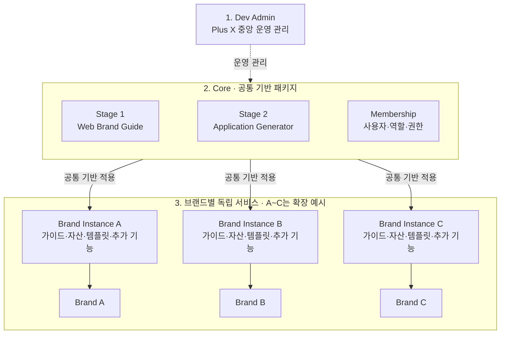
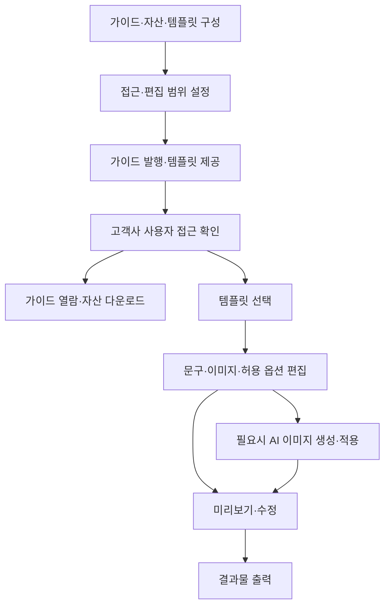

# LBS PRD v2

> 2026-09-28 · 내부 검토 초안
> 기획·디자인·개발 협업자가 제품 방향과 범위를 합의하고 마일스톤을 준비하기 위한 문서다.

## 1. 개요

**LBS는 고객사 실무자가 브랜드 가이드와 자산을 확인하고, 브랜드 기준이 반영된 템플릿으로 산출물을 만드는 서비스다.**

브랜드 가이드를 전달하는 데서 끝나지 않고 실제 제작에 활용하도록 연결한다. 디자인 전문 지식이 없는 사람도 필요한 내용을 입력해 포스터·배너 등을 만들 수 있도록 한다.

Plus X는 이 서비스를 여러 브랜드에 반복 제공하기 위해 공통 기능을 재사용하고, 브랜드별 콘텐츠·설정·추가 기능으로 구성한다.

## 2. 타겟과 문제 정의

### 주요 사용자

브랜드 자산을 확인하고 활용하는 **고객사 실무자**가 주요 사용자다. 마케터·비디자이너뿐 아니라 브랜드 담당자·디자이너도 포함한다. 디자인 조직의 유무로 고객을 제한하지 않는다.

산출물 제작 경험은 **무엇을 전달할지는 알지만, 브랜드에 맞는 디자인으로 만드는 데 어려움을 겪는 사람**을 기준으로 설계한다.

| 항목 | 대표적인 업무 상황 |
|---|---|
| 직무 | 마케터, 브랜드 운영 담당자, 행사·매장·영업 지원 실무자 |
| 제작 업무 | 캠페인 배너, SNS 홍보물, 행사 포스터, 현장 안내물 등 반복 제작 |
| 알고 있는 정보 | 전달할 문구, 일정, 상품 정보, 사용 채널 |
| 어려운 판단 | 서체·여백·정렬·색상 조합·이미지 구도·출력 규격 |
| 필요한 경험 | 용도에 맞는 틀을 선택하고 내용만 바꾼 뒤 결과물을 내려받기 |

이 업무 상황은 설계를 위한 타겟 가설이다. 구체적인 고객 조직과 우선 제작물은 추가 확인한다. 전문 디자이너의 자유로운 신규 디자인 작업을 대체하는 것이 주목적은 아니다.

### 고객사가 겪는 문제

아래는 프로젝트 배경과 회의에서 제기된 문제다. 발생 빈도와 영향은 실제 고객 업무에서 검증해야 한다.

| 문제 | 작업에서 생기는 어려움 |
|---|---|
| 필요한 기준과 자산을 찾기 어렵다. | 여러 파일 중 무엇이 최신인지 확인하고 필요한 자료를 찾아야 한다. |
| 가이드를 실제 제작에 적용하기 어렵다. | 가이드를 읽어도 서체·배치·색상을 어떻게 적용할지 다시 판단해야 한다. |
| 반복 제작에도 디자인 작업이 필요하다. | 문구·이미지만 바꾸는 작업도 디자이너에게 요청하거나 별도 도구를 다뤄야 한다. |
| 수정 과정에서 브랜드 표현이 달라질 수 있다. | 사용자가 레이아웃·로고 위치 등을 바꾸며 기존 기준에서 벗어날 수 있다. |

### Plus X의 제공·운영 문제

브랜드마다 가이드 관리와 제작 기능을 새로 구축하면 유사한 개발이 반복된다. 반대로 모든 브랜드를 같은 틀에 맞추면 고유한 표현을 담기 어렵다.

따라서 **반복 기능은 재사용하면서 브랜드별 차이를 반영하는 구조**가 필요하다.

## 3. 제품 목표와 해결 방향

### 고객사의 제작 문제를 해결한다

| 문제 | 해결 방향 | 제품 목표 |
|---|---|---|
| 기준·자산 탐색의 어려움 | 발행된 가이드와 연결 자산을 웹에서 제공한다. | 사용자가 필요한 기준과 자산을 확인한다. |
| 디자인 적용·판단의 어려움 | 브랜드 기준을 템플릿에 반영한다. | 비디자이너도 필요한 내용만 입력해 제작을 완료한다. |
| 수정에 따른 표현 불일치 | 수정 가능한 항목과 선택 범위를 제한한다. | 정해진 디자인 틀 안에서 결과물을 만든다. |

사용자는 **용도·문구·이미지**를 결정한다. 시스템은 **레이아웃·서체 규칙·로고 위치·허용 색상과 출력 옵션**을 제공한다.

빈 캔버스 대신 템플릿에서 시작하고, 디자인 용어보다 사용 목적을 기준으로 선택하게 한다. AI 이미지 생성도 전문 프롬프트 작성 능력을 요구하지 않는 방향으로 설계한다.

### 여러 브랜드에 반복 제공한다

| 구분 | 적용 방식 |
|---|---|
| 공통 기반 | 가이드 관리, 템플릿 편집, 접근 관리 등 반복 기능을 재사용한다. |
| 브랜드별 구성 | 로고·서체·컬러·콘텐츠·템플릿·그래픽 프리셋을 설정한다. |
| 브랜드별 확장 | 공통 기능과 설정으로 대응하기 어려운 요구만 추가 개발한다. |

이 도식은 서비스 구성 개념도이며 백엔드 협의 전 초안이다. 실선은 공통 기반 적용과 브랜드별 제공 관계, 점선은 운영 관리 관계를 뜻한다. 실행 시 데이터 흐름이나 중앙 서버 의존성을 나타내지 않는다.

Dev Admin은 설치·버전·운영 현황을 관리하는 영역이다. 수집할 운영 데이터와 고객 동의·접근 범위는 별도 설계한다. Core 업데이트의 브랜드별 반영 방식도 미정이다.

브랜드별 독립 서비스 운영을 기본 방향으로 한다. 재사용하는 것은 기능과 구조이며, 서로 다른 브랜드의 실제 자산을 공용으로 섞어 쓰지 않는다.

## 4. 서비스 흐름과 핵심 기능

### 참여자

| 참여자 | 역할 |
|---|---|
| Plus X 내부 제작자·운영자 | 가이드·자산·템플릿을 구성하고 발행한다. 그래픽 효과를 조합해 재사용할 프리셋을 만든다. |
| 고객사 실무자 | 가이드·자산을 확인하고 템플릿을 활용해 산출물을 만든다. 디자이너도 포함한다. |
| 관리 권한을 받은 고객사 담당자 | 허용된 범위에서 가이드·템플릿 관리에 참여한다. 직무만으로 권한이 부여되지는 않는다. |
| 고객사 도입 의사결정자 | 보안·운영·비용 조건을 검토한다. 구체적인 담당 직무는 추가 확인한다. |

### 서비스 흐름

가이드 열람과 산출물 제작은 필요에 따라 선택한다. 가이드를 모두 읽어야 제작할 수 있도록 강제하지 않는다. AI 이미지 생성도 선택 과정이다.

생성·저장·출력 실패 시 입력 내용을 유지하고 실패 안내와 재시도 경로를 제공하는 것을 설계 기준으로 삼는다.

### 흐름을 지원하는 핵심 기능

아래는 제품이 지향하는 범위다. 구현 완료 목록이나 첫 배포 확정 범위가 아니다.

| 영역 | 핵심 기능 |
|---|---|
| Stage 1 · 가이드 구성·발행 | 텍스트·이미지 등 콘텐츠를 1~3단 레이아웃으로 구성하고 저장·버전·발행을 관리한다. |
| Stage 1 · 가이드 활용 | 발행된 가이드와 연결 자산을 확인하고 허용된 파일을 내려받는다. |
| Stage 2 · 템플릿 관리 | 용도별 템플릿을 등록하고 사용자가 바꿀 항목과 범위를 설정한다. |
| Stage 2 · 산출물 제작 | 갤러리에서 템플릿을 선택하고 편집·미리보기 후 디지털·인쇄용 결과물을 출력한다. 지원 규격은 별도 결정한다. |
| Stage 2 · AI 이미지 생성 | 브랜드 콘셉트에 맞는 이미지를 생성해 제작에 활용한다. 상세 흐름은 추가 설계한다. |
| 내부 그래픽 제작 지원 | 효과를 조합하고 설정을 프리셋으로 저장한다. 공통 효과로 표현하기 어려운 경우 별도 개발·자산 제작으로 대응한다. |
| Membership · 접근 관리 | 고객사별 제공 범위 안에서 사용자·역할별 권한을 부여·변경·회수한다. |

Stage 1·2는 서비스 영역이며 개발 1차·2차를 뜻하지 않는다. Graphic Generator는 내부 제작자용 기능이며, 고객 편집 화면에 프리셋을 연결하는 방식은 미정이다.

### 운영 원칙과 범위

- 고객사별 관리·수정 기능의 제공 범위를 설정한다. 그 안에서 사용자 또는 역할별 권한을 관리한다.
- 템플릿으로 결과물을 편집하는 권한과 템플릿 원본을 관리하는 권한은 구분한다. 수정 권한이 발행 권한까지 자동 포함하지는 않는다.
- 입력 누락·양식 오류는 안내하되, 별도 자동 브랜드 검수 서비스와 검수 결과 기반 피드백 순환 기능은 포함하지 않는다.
- 범용 디자인 도구처럼 자유 배치·무제한 편집을 제공하지 않는다. PDF 자동 분석을 가이드의 기본 입력 방식으로 삼지 않는다.

## 5. 기대효과

다음은 제품을 통해 기대하는 변화이며, 검증된 성과나 확정된 절감 수치는 아니다.

| 대상 | 기대효과 | 효과를 만드는 방식 |
|---|---|---|
| 고객사 실무자 | 자료 탐색과 디자인 판단 부담 감소 | 웹 가이드·자산 제공, 용도별 템플릿과 제한된 입력 |
| 고객사 디자이너·브랜드 담당자 | 반복 수정 요청 부담 감소 | 실무자가 허용된 범위에서 문구·이미지를 직접 변경 |
| 고객 조직 | 담당자가 바뀌어도 일관된 브랜드 표현 유지 | 발행 기준과 제작 템플릿을 제공하고 접근·편집 범위를 관리 |
| Plus X | 반복 구축 부담 감소와 브랜드별 차별화 유지 | 공통 기능 재사용, 설정 기반 구성, 필요한 영역만 추가 개발 |
| Plus X와 고객사 | 프로젝트 종료 후에도 브랜드 자산 활용 확대 | 정적 파일 전달에서 웹 기반 활용·운영으로 확장 |

## 6. 앞으로 해야 할 일

### 먼저 결정할 사항

| 항목 | 확인할 내용 |
|---|---|
| 첫 검증 대상 | 어떤 고객의 어떤 업무·산출물로 검증할 것인가 |
| 첫 배포 범위 | 구현 목표·후속 후보를 어떻게 나누고, 무엇을 완료 기준으로 삼을 것인가 |
| 자산 연결 | Stage 1–2 사이 복제·참조·변경 반영을 어떤 조건으로 적용할 것인가 |
| 권한 정책 | 누가 권한을 관리하며, 첫 배포에서 어떤 역할·수정·발행 권한을 구분할 것인가. 회수는 어떻게 적용할 것인가 |
| 생성·출력 | 이미지 생성 입력 방식, 그래픽 프리셋 연결, 파일 형식·인쇄 조건을 어디까지 지원할 것인가 |
| 배포·운영 | 설치 환경, 보안, AI 키 운영, 운영 기록 수집 범위, 브랜드별 업데이트 방식을 어떻게 정할 것인가 |
| 제공 조건 | 웹 가이드 제공 후 제작 기능으로 확장하는 제안의 적용 여부와 무료·유료·설치형 조건을 어떻게 정할 것인가 |

웹 가이드를 진입점으로 제공하는 사업화 방식과 세부 운영 정책은 아직 확정되지 않았다. 고객사별 권한 구조의 필요성은 9월 22일에 논의했고, 권한 부여·변경·회수 방향은 9월 28일 사용자 협의로 구체화했다.

### 협의와 실행 순서

1. 구현 목표·후속 후보·결정 필요사항을 정리한다. 목표마다 사용자 흐름과 완료 기준을 붙인다.
2. 디렉터와 방향·우선순위·첫 배포 범위를 검토한다. 개발 일정은 잠정 상태로 둔다.
3. 프론트엔드·백엔드 개발자와 작업·선행 조건·공수·불확실성을 확인한다. 큰 기술 쟁점은 사전 검토한다.
4. 연결된 사용자 흐름을 기준으로 마일스톤을 정하고 WBS의 담당자·기간을 맞춘다. 통합 테스트·수정·배포도 포함한다.
5. 목표 기간에 맞지 않으면 범위 또는 일정을 조정해 다시 합의한다.

기존 10월 16일 목표는 범위와 달성 가능성을 재검토한다. 이 문서에서 새 일정이나 세부 구현 범위를 확정하지 않는다.

---

작성 근거: 9월 22일 회의 자료, 9월 23일 프로젝트 컨텍스트, 9월 28일 사용자 협의. 내부 원문은 로컬 `Meetings/2026-09-22/`에 보관한다. 기존 PRD와 수정 전 v2는 별도로 보존한다.
